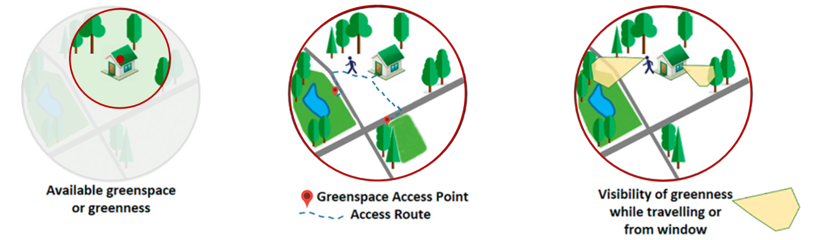

# InVEST mental health model

## General information 
* [Design doc](https://docs.google.com/document/d/1h3M5kNG7UyWXREg6LEhTfY2tvIyI1dRjxHbpa8VTEEM/edit?usp=sharing)
* [Mental health prototype model design doc](https://docs.google.com/document/d/1_d6IOOurUzfObgyQLN81KvM_KZz7eypWf4hYmoS7URM/edit#heading=h.5g60p2czv3bh)


## Directory structure
```
invest-mental-health/
  |- code/ ................... R and Python scripts for preprocessing raw data
  |- data/ ................... raw data as examples
  |- docs/ ................... docs and slides
  |- figures/ ................ 
  |- processing/
  |- results/
  |- .gitignore .............. tells git not to track certain files
```

## Nature Exposure

Urban nature exposure can be measured in different ways. Here, we present the three most commonly used nature exposure measurements that relate to mental health outcomes. 

Detailed description can be found in this [Google Slide](https://docs.google.com/presentation/d/189DM6Cf0j2CCCwn8CQ9EbI6i2mIGPo2Xb-0KmNzHA6s/edit?usp=sharing)

* ***nature availability*** ...... the amount of nature (e.g., % of greenspace, average greenness/NDVI) near residential areas or workplaces

* ***nature visibility*** ...... the visible green considering topography and buildings

* ***nature accessibility*** ...... see [InVEST Urban Nature Access model](https://storage.googleapis.com/releases.naturalcapitalproject.org/invest-userguide/latest/en/urban_nature_access.html)

<p align="center">
  
</p>


*<div align="right"> Modified from [Labib et al 2021](https://doi.org/10.1016/j.scitotenv.2021.147919) </div>*


## Mental health
