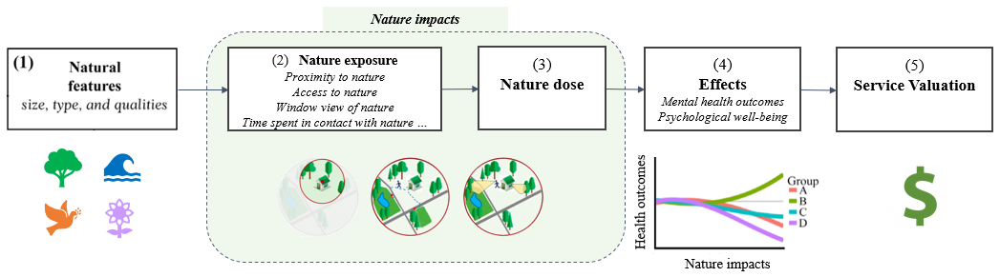

[](https://www.gnu.org/licenses/gpl-3.0)


# InVEST mental health model

<p align="center">
  
</p>


## General information 
* [Mental health model design doc](https://docs.google.com/document/d/1B68zhzlO5tY0L8uDSnFGt1CxBpBEjGu6J2_7XAxfV9k/edit?usp=sharing)
* [Data and log doc](https://docs.google.com/document/d/1h3M5kNG7UyWXREg6LEhTfY2tvIyI1dRjxHbpa8VTEEM/edit?usp=sharing)

## Directory structure
```
invest-mental-health/
  ├── code/
      ├── nature-availability/ 
      ├── nature-accessibility/
      ├── nature-visibility/
  ├── data/ 
      ├── raw
      ├── intermediate
      ├── output
      ├── para_nature_health            # parameters for modeling nature-health relation
      ├── example                       # example data for modeling
  ├── docs/
  ├── figures/

```

## Nature Exposure

Urban nature exposure can be measured in different ways. Here, we present the three most commonly used nature exposure measurements that relate to mental health outcomes. 

Detailed description can be found in this [Google Slide](https://docs.google.com/presentation/d/189DM6Cf0j2CCCwn8CQ9EbI6i2mIGPo2Xb-0KmNzHA6s/edit?usp=sharing)

* ***nature availability*** ...... the amount of nature (e.g., % of greenspace, average greenness/NDVI) near residential areas or workplaces

* ***nature accessibility*** ...... see [InVEST Urban Nature Access model](https://storage.googleapis.com/releases.naturalcapitalproject.org/invest-userguide/latest/en/urban_nature_access.html)

* ***nature visibility*** ...... the visible green considering topography and buildings


<p align="center">
  
</p>


*<div align="right"> Modified from [Labib et al 2021](https://doi.org/10.1016/j.scitotenv.2021.147919) </div>*


## Mental Health

<TBD ...>


## Nature-Health Model Integration 

<TBD ...>


## Key References
- Bratman, G.N., Anderson, C.B., Berman, M.G., Cochran, B., Vries, S. de, Flanders, J., Folke, C., Frumkin, H., Gross, J.J., Hartig, T., Kahn, P.H., Kuo, M., Lawler, J.J., Levin, P.S., Lindahl, T., Meyer-Lindenberg, A., Mitchell, R., Ouyang, Z., Roe, J., Scarlett, L., Smith, J.R., Bosch, M. van den, Wheeler, B.W., White, M.P., Zheng, H., Daily, G.C., 2019. [Nature and mental health: An ecosystem service perspective](https://advances.sciencemag.org/content/5/7/eaax0903). ***Science Advances*** 5, eaax0903. https://doi.org/10.1126/sciadv.aax0903
- Remme, R.P., Frumkin, H., Guerry, A.D., King, A.C., Mandle, L., Sarabu, C., Bratman, G.N., Giles-Corti, B., Hamel, P., Han, B., Hicks, J.L., James, P., Lawler, J.J., Lindahl, T., Liu, H., Lu, Y., Oosterbroek, B., Paudel, B., Sallis, J.F., Schipperijn, J., Sosič, R., Vries, S. de, Wheeler, B.W., Wood, S.A., Wu, T., Daily, G.C., 2021. [An ecosystem service perspective on urban nature, physical activity, and health](https://www.pnas.org/content/118/22/e2018472118). ***PNAS*** 118. https://doi.org/10.1073/pnas.2018472118


